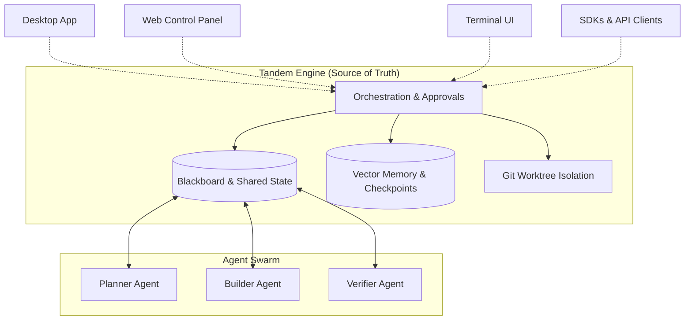
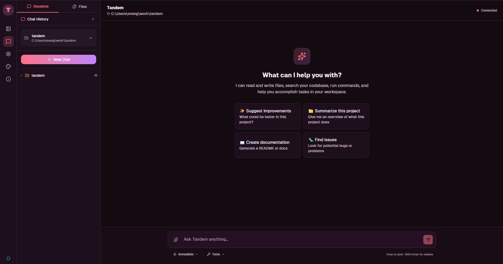

<div align="center">
  
  
  <p>
    <a href="https://tandem.ac/"></a>
    <a href="https://github.com/frumu-ai/tandem/actions/workflows/ci.yml"></a>
    <a href="https://github.com/frumu-ai/tandem/actions/workflows/publish-registries.yml"></a>
    <a href="https://github.com/frumu-ai/tandem/releases"></a>
    <a href="https://www.npmjs.com/package/@frumu/tandem-client"></a>
    <a href="https://pypi.org/project/tandem-client/"></a>
    <a href="LICENSE"></a>
    <a href="https://github.com/sponsors/frumu-ai"></a>
  </p>
</div>

<p align="center">
  <a href="README.md">English</a> | <a href="README.zh-CN.md">简体中文</a>
</p>

Tandem is an **engine-owned workflow runtime** for coordinated autonomous work.

While the current landscape of AI agents is flooded with "chat-first assistants," these conversational routing models inevitably fail at scale due to context bloat and concurrency blindness. **Chat is fine as an interface, but it is weak as an authoritative coordination substrate for parallel, durable engineering workflows.**

Tandem takes a fundamentally different approach to tackle the complex realities of agentic engineering. **We treat autonomous execution as a distributed systems problem**, prioritizing robust engine state over fragile chat transcripts.

It provides durable coordination primitives, including blackboards, workboards, explicit task claiming, operational memory accumulation, and checkpoints, allowing multiple agents to work concurrently on complex, long-running software engineering and automation tasks without colliding.

- **Entrypoints are clients, not separate engines:** The Tauri desktop app, TUI, web control panel, and SDKs all talk to the same engine runtime.
- **Engine-owned orchestration:** Shared task state, replay, approvals, and deterministic workflow projections natively solve coordination failures.
- **Provider agnostic:** Use OpenRouter, Anthropic, OpenAI, OpenCode Zen, or local Ollama endpoints effortlessly.
- **Codex account auth for local Tandem:** Connect a Codex account through the local control panel so heavy testing can use your ChatGPT/Codex allocation instead of requiring a separate OpenAI API key or more OpenRouter spend.

`Durable State → Workboards → Agent Swarm → Artifacts`

**→ [Connect an agent via MCP](https://tandem.ac/docs-mcp) · [Download desktop app](https://tandem.ac/) · [Read the docs](https://docs.tandem.ac/)**

## 30-second quickstart

### Web Control Panel

Install the master CLI, then bootstrap the panel and its engine service:

```bash
npm i -g @frumu/tandem
tandem install panel
tandem panel init
tandem panel open
```

Use this when you want the browser-based control center backed by the engine.

For local installs, you can now open **Settings -> Providers -> openai-codex** and choose **Connect Codex Account** to sign in through the browser instead of pasting an OpenAI API key.

### Desktop

1. Download and launch Tandem: [tandem.ac](https://tandem.ac/)
2. Open **Settings** and add a provider API key, or use the local control panel to connect a Codex account for `openai-codex`.
3. Select a workspace folder.
4. Start with a task prompt and choose **Immediate** or **Plan Mode**.

### Editable App Scaffold

Generate a fully editable control panel app in your own folder:

```bash
npm create tandem-panel@latest my-panel
cd my-panel
npm install
npm run dev
```

Use this when you want to customize routes, pages, themes, styles, or runtime behavior without editing `node_modules`.

### MCP-assisted setup

If you want an existing agent to help install or configure Tandem, connect that agent to Tandem's MCP interface first. The MCP docs explain how to wire your own agent into Tandem so it can assist with setup, configuration, and follow-up tasks:

- [Tandem MCP docs](https://tandem.ac/docs-mcp)

If you only want the engine runtime, you can keep it foreground-only:

```bash
tandem-engine serve --hostname 127.0.0.1 --port 39731
```

### Other Entry Points

- TUI: `npm i -g @frumu/tandem-tui && tandem-tui`
- SDKs: `npm install @frumu/tandem-client` or `pip install tandem-client`

## Architecture



## Common workflows

| Task                               | What Tandem does                                                               |
| ---------------------------------- | ------------------------------------------------------------------------------ |
| Refactor a codebase safely         | Scans files, proposes a staged plan, shows diffs, and applies approved changes |
| Research and summarize sources     | Reads multiple references and outputs structured summaries                     |
| Generate recurring reports         | Runs scheduled automations and produces markdown/dashboard artifacts           |
| Connect external tools through MCP | Uses configured MCP connectors with approval-aware execution                   |
| Operate AI workflows via API       | Run sessions through local/headless HTTP + SSE endpoints                       |

## Features

### Engine-Owned Workflow Runtime

- **Coordinated autonomous work:** Explicit blackboards over conversational thread dumping.
- **Multi-simultaneous agents:** Manage parallel execution through Git Worktree Isolation and patch streams.
- **State survival:** Checkpoints, replayable event history, and materialized run states.
- **Approval gates:** Keep humans in control with supervised tool flows for destructive actions.

### Multi-Agent Orchestration

- **Kanban-driven execution:** Agents claim tasks, report blockers, and hand off work through deterministic state.
- **Memory-aware swarms:** Agents learn from prior runs, extracting fixes and failure patterns automatically.
- **Revisioned coordination:** Engine-enforced locks prevent agents from trampling the same codebase simultaneously.

### Integrations and automation

- MCP tool connectors
- Scheduled automations and routines
- Headless runtime with HTTP + SSE APIs
- Desktop runtime for Windows, macOS, and Linux

### Security and local-first controls

- API keys encrypted in local SecureKeyStore (AES-256-GCM)
- Local Codex OAuth credentials stay engine-owned; browser UIs initiate sign-in but do not persist refresh tokens
- Workspace access is scoped to folders you explicitly grant
- Write/delete operations require approval via supervised tool flow
- Sensitive paths denied by default (`.env`, `.ssh/*`, `*.pem`, `*.key`, secrets folders)
- No analytics or call-home telemetry from Tandem itself

### Outputs and artifacts

- Markdown reports
- HTML dashboards
- PowerPoint (`.pptx`) generation

## Programmatic API

The SDKs are API clients. They do **not** bundle `tandem-engine`.  
You need a running Tandem runtime (desktop sidecar or headless engine) and then use the SDKs to create sessions, trigger runs, and stream events.

Runtime options:

- Desktop app running locally (starts the sidecar runtime)
- Headless engine via npm:

  ```bash
  npm install -g @frumu/tandem
  tandem-engine serve --hostname 127.0.0.1 --port 39731
  ```

- TypeScript SDK: [@frumu/tandem-client](https://www.npmjs.com/package/@frumu/tandem-client)
- Python SDK: [tandem-client](https://pypi.org/project/tandem-client/)
- Engine package: [@frumu/tandem](https://www.npmjs.com/package/@frumu/tandem)

```typescript
// npm install @frumu/tandem-client
import { TandemClient } from "@frumu/tandem-client";

const client = new TandemClient({ baseUrl: "http://localhost:39731", token: "..." });
const sessionId = await client.sessions.create({ title: "My agent" });
const { runId } = await client.sessions.promptAsync(sessionId, "Summarize README.md");

for await (const event of client.stream(sessionId, runId)) {
  if (event.type === "session.response") process.stdout.write(event.properties.delta ?? "");
}
```

```python
# pip install tandem-client
from tandem_client import TandemClient

async with TandemClient(base_url="http://localhost:39731", token="...") as client:
    session_id = await client.sessions.create(title="My agent")
    run = await client.sessions.prompt_async(session_id, "Summarize README.md")
    async for event in client.stream(session_id, run.run_id):
        if event.type == "session.response":
            print(event.properties.get("delta", ""), end="", flush=True)
```

<div align="center">
  
</div>

## Provider setup

Configure providers in **Settings**.

| Provider                 | Description                                      | Get API key                                                          |
| ------------------------ | ------------------------------------------------ | -------------------------------------------------------------------- |
| **OpenAI Codex Account** | Browser sign-in for local Codex-account usage    | Local control panel: **Settings -> Providers -> openai-codex**       |
| **OpenRouter** ⭐        | Access many models through one API               | [openrouter.ai/keys](https://openrouter.ai/keys)                     |
| **OpenCode Zen**         | Fast, cost-effective models optimized for coding | [opencode.ai/zen](https://opencode.ai/zen)                           |
| **Anthropic**            | Anthropic models (Sonnet, Opus, Haiku)           | [console.anthropic.com](https://console.anthropic.com/settings/keys) |
| **OpenAI**               | GPT models and OpenAI endpoints                  | [platform.openai.com](https://platform.openai.com/api-keys)          |
| **Ollama**               | Local models (no remote API key required)        | [Setup Guide](docs/OLLAMA_GUIDE.md)                                  |
| **Custom**               | OpenAI-compatible API endpoint                   | Configure endpoint URL                                               |

Notes:

- `openai-codex` is currently intended for local engine-backed Tandem setups.
- Standard OpenAI API keys remain supported for the normal `openai` provider.

## Web search setup

`websearch` can now be configured directly from:

- Desktop: **Settings -> Web Search**
- Control panel: **Settings -> Web Search** when connected to a local managed engine

Recommended default:

- `Backend = auto`
- add a Brave key, an Exa key, or both

`auto` prefers configured providers and can fall through across backends instead of pinning the engine to a single hosted search path. For headless installs you can still configure this through env vars:

```env
TANDEM_SEARCH_BACKEND=auto
TANDEM_BRAVE_SEARCH_API_KEY=...
TANDEM_EXA_API_KEY=...
TANDEM_SEARXNG_URL=http://127.0.0.1:8080
TANDEM_SEARCH_URL=https://search.tandem.ac
```

If Brave is rate-limited and Exa is configured, `auto` can continue with Exa instead of immediately surfacing search as unavailable.

## Design principles

- **Local-first runtime**: Data and state stay on your machine unless you send prompts/tools to configured providers.
- **Supervised execution**: AI runs through controlled tools with explicit approvals for write/delete operations.
- **Provider agnostic**: Route through the model providers you choose.
- **Open source and auditable**: MIT repo license, `MIT OR Apache-2.0` for most Rust crates, and `BUSL-1.1` for `tandem-plan-compiler` as documented in [docs/LICENSING.md](docs/LICENSING.md).

## Security and privacy

- **Telemetry**: Tandem does not include analytics/tracking or call-home telemetry.
- **Provider traffic**: AI request content is sent only to endpoints you configure (cloud providers or local Ollama/custom endpoints).
- **Network scope**: Desktop runtime communicates with the local sidecar (`127.0.0.1`) and configured endpoints.
- **Updater/release checks**: App update and release metadata flows can contact GitHub endpoints.
- **Credential storage**: Provider keys are stored encrypted (AES-256-GCM).
- **Filesystem safety**: Access is scoped to granted folders; sensitive paths are denied by default.

For the full threat model and reporting process, see [SECURITY.md](SECURITY.md).

## Learn more

- Architecture overview: [ARCHITECTURE.md](ARCHITECTURE.md)
- Engine runtime + CLI reference: [docs/ENGINE_CLI.md](docs/ENGINE_CLI.md)
- Desktop/runtime communication contract: [docs/ENGINE_COMMUNICATION.md](docs/ENGINE_COMMUNICATION.md)
- Engine testing and smoke checks: [docs/ENGINE_TESTING.md](docs/ENGINE_TESTING.md)
- Docs portal: [docs.tandem.ac](https://docs.tandem.ac/)

Advanced MCP behavior (including OAuth/auth-required flows and retries) is documented in [docs/ENGINE_CLI.md](docs/ENGINE_CLI.md).

## Advanced setup (build from source)

### Prerequisites

- [Node.js](https://nodejs.org/) 20+
- [Rust](https://rustup.rs/) 1.75+ (includes `cargo`)
- [pnpm](https://pnpm.io/) (recommended) or npm

| Platform | Additional requirements                                                                          |
| -------- | ------------------------------------------------------------------------------------------------ |
| Windows  | [Build Tools for Visual Studio](https://visualstudio.microsoft.com/downloads/)                   |
| macOS    | Xcode Command Line Tools: `xcode-select --install`                                               |
| Linux    | `libwebkit2gtk-4.1-dev`, `libappindicator3-dev`, `librsvg2-dev`, `build-essential`, `pkg-config` |

### Local development

```bash
git clone https://github.com/frumu-ai/tandem.git
cd tandem
pnpm install
cargo build -p tandem-ai
pnpm tauri dev
```

### Production build and signing notes

```bash
pnpm tauri build
```

For local self-built updater artifacts, generate your own signing keys and configure:

1. `pnpm tauri signer generate -w ./src-tauri/tandem.key`
2. `TAURI_SIGNING_PRIVATE_KEY`
3. `TAURI_SIGNING_PASSWORD`
4. `pubkey` in `src-tauri/tauri.conf.json`

Reference: [Tauri signing documentation](https://tauri.app/v1/guides/distribution/updater/#signing-updates)

Output paths:

```bash
# Windows: src-tauri/target/release/bundle/msi/
# macOS:   src-tauri/target/release/bundle/dmg/
# Linux:   src-tauri/target/release/bundle/appimage/
```

### macOS install troubleshooting

If a downloaded `.dmg` shows "damaged" or "corrupted", Gatekeeper is usually rejecting an app bundle/DMG that is not Developer ID signed and notarized.

1. Confirm the correct architecture (`aarch64/arm64` vs `x86_64/x64`).
2. Try opening via Finder (`Right click -> Open` or `System Settings -> Privacy & Security -> Open Anyway`).
3. For non-technical distribution, ship signed + notarized artifacts from release automation.

## Contributing

Contributions are welcome. See [CONTRIBUTING.md](CONTRIBUTING.md).

```bash
# Run lints
pnpm lint

# Run tests
pnpm test
cargo test

# Format code
pnpm format
cargo fmt
```

Engine-specific build/run/smoke instructions: `docs/ENGINE_TESTING.md`  
Engine CLI usage reference: `docs/ENGINE_CLI.md`  
Engine runtime communication contract: `docs/ENGINE_COMMUNICATION.md`

### Maintainer release note

- Desktop binary/app release: `.github/workflows/release.yml` (tag pattern `v*`)
- Registry publish (crates.io + npm wrappers): `.github/workflows/publish-registries.yml` (manual trigger or `publish-v*`)
- The workflows are intentionally separate

## Project structure

```text
tandem/
├── src/                    # React frontend
│   ├── components/         # UI components
│   ├── hooks/              # React hooks
│   └── lib/                # Utilities
├── src-tauri/              # Rust backend
│   ├── src/                # Rust source
│   ├── capabilities/       # Permission config
│   └── binaries/           # Sidecar (gitignored)
├── scripts/                # Build scripts
└── docs/                   # Documentation
```

## Roadmap

- [x] **Phase 1: Security Foundation** - Encrypted vault, permission system
- [x] **Phase 2: Sidecar Integration** - Tandem agent runtime
- [x] **Phase 3: Glass UI** - Modern, polished interface
- [x] **Phase 4: Provider Routing** - Multi-provider support
- [x] **Phase 5: Agent Capabilities** - Multi-mode agents, execution planning
- [x] **Phase 6: Project Management** - Multi-workspace support
- [x] **Phase 7: Advanced Presentations** - PPTX export engine, theme mapping, explicit positioning
- [x] **Phase 8: Brand Evolution** - Rubik 900 typography, polished boot sequence
- [x] **Phase 9: Memory & Context** - Vector database integration (`sqlite-vec`)
- [x] **Phase 10: Skills System** - Importable agent skills and custom instructions
- [ ] **Phase 11: Browser Integration** - Web content access
- [ ] **Phase 12: Team Features** - Collaboration tools
- [ ] **Phase 13: Mobile Companion** - iOS/Android apps

## Support this project

If Tandem saves you time, consider [sponsoring development](https://github.com/sponsors/frumu-ai).

[❤️ Become a Sponsor](https://github.com/sponsors/frumu-ai)

## Star history

[](https://www.star-history.com/#frumu-ai/tandem&type=date&logscale&legend=top-left)

## License

This repository uses a mixed licensing model:

- Core engine crates and tools (e.g. `tandem-core`, `tandem-server`, `tandem-types`, `tandem-orchestrator`, and others in `crates/`):
  - Licensed under `MIT OR Apache-2.0` (see [LICENSE](LICENSE) and [LICENSE-APACHE](LICENSE-APACHE))

- Mission compiler crate (`tandem-plan-compiler`):
  - Licensed under Business Source License 1.1 (`BSL-1.1`)
  - See `crates/tandem-plan-compiler/LICENSE` for terms

In short: the runtime engine is fully open source (MIT/Apache), the mission/plan compiler is source-available under BSL.

## Acknowledgments

- [Anthropic](https://anthropic.com) for the Cowork inspiration
- [Tauri](https://tauri.app) for the secure desktop framework
- The open source community
