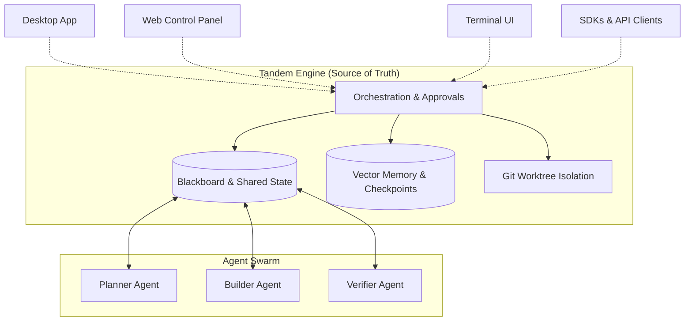

<div align="center">
  
  
  <p>
    <a href="https://tandem.ac/"></a>
    <a href="https://github.com/frumu-ai/tandem/actions/workflows/ci.yml"></a>
    <a href="https://github.com/frumu-ai/tandem/actions/workflows/publish-registries.yml"></a>
    <a href="https://github.com/frumu-ai/tandem/releases"></a>
    <a href="https://www.npmjs.com/package/@frumu/tandem-client"></a>
    <!-- <a href="https://pypi.org/project/tandem-client/"></a> -->
    <a href="LICENSE"></a>
    <a href="https://github.com/sponsors/frumu-ai"></a>
  </p>
</div>

<p align="center">
  <a href="README.md">English</a> | <a href="README.zh-CN.md">简体中文</a>
</p>

**Tandem 是一个面向协调自治工作流的引擎主导型（engine-owned）运行时。**

当前 AI Agent 领域充斥着“对话优先助手（chat-first assistants）”，但这些基于对话流由的模型在处理复杂任务时，不可避免地会遭遇上下文膨胀与并发盲区的瓶颈。**对话作为一种交互界面（UI）是极好的，但作为并行、持久的工程工作流的权威协调底座（coordination substrate）则是脆弱的。**

Tandem 采取了截然不同的方法来应对工程化 Agent 的复杂现实。**我们将自治执行视为一个分布式系统问题**，优先维护稳健的引擎状态，而不是脆弱的对话记录。

它提供了持久化、坚固的协调原语——例如黑板（blackboards）、工作板（workboards）、显式任务认领、操作性记忆积累和检查点（checkpoints）——允许多个 Agent 并发地执行复杂且长时间运行的工程或自动化任务，彻底阻绝冲突碰撞。

- **多客户端，单一引擎：** 桌面端应用、TUI 以及无头 API 全部基于完全一致的具象化状态真相运作。
- **引擎主导的编排机制：** 共享的任务状态、全局流重放（replay）、审核流以及确定性的工作流投影，从原生层面解决了协调失效问题。
- **提供商无绑定：** 支持 OpenRouter、Anthropic、OpenAI、OpenCode Zen，或通过 Ollama 本地轻松运行模型。

`持久状态 → 工作板 → 智能体 Swarm → 结构化产物`

可作为桌面应用运行、在 VPS 上以无头服务运行，或通过 HTTP + SSE API 从任意语言接入。

```bash
# 选项 1：快速运行（无需全局安装与源码）：
npx @frumu/tandem-panel

# 选项 2：可修改源码与系统服务安装（Hackable / Systemd）：
git clone https://github.com/frumu-ai/tandem.git
cd tandem/examples/agent-quickstart
sudo bash setup-agent.sh
```



```python
# pip install tandem-client
from tandem_client import TandemClient

async with TandemClient(base_url="http://localhost:39731", token="...") as client:
    session_id = await client.sessions.create(title="My agent")
    run = await client.sessions.prompt_async(session_id, "Summarize README.md")
    async for event in client.stream(session_id, run.run_id):
        if event.type == "session.response":
            print(event.properties.get("delta", ""), end="", flush=True)
```

**→ [下载桌面版](https://tandem.ac/) · [5 分钟部署到 VPS](examples/agent-quickstart/) · [阅读文档](https://docs.tandem.ac/)**

<div align="center">
  
</div>

灵感来自早期 AI 协作研究预览，但 Tandem 是开源且与模型提供商无绑定的。

## 为什么选择 Tandem？

**🔒 隐私优先**：不同于云端 AI 工具，Tandem 运行在你的机器上。你的代码、文档和 API 密钥不会发送到我们的服务器，因为我们没有这类服务器。

**💰 提供商无绑定**：可使用任意 LLM 提供商，不被单一厂商锁定。可在 OpenRouter、Anthropic、OpenAI 之间切换，或通过 Ollama 本地运行模型。

**🛡️ 零信任**：每次文件操作都需要明确审批。AI agent 功能很强，但 Tandem 将其视为“需受监督的不受信任承包方”。

**🌐 真正跨平台**：Windows、macOS（Intel 与 Apple Silicon）和 Linux 原生应用。不是 Electron 套壳，基于 Tauri，性能更高、占用更低。

**📖 开源**：采用宽松开源许可。Rust crates 使用 MIT OR Apache-2.0 双许可。

**🛠️ 现代技术栈**：基于 **Rust**、**Tauri**、**React** 和 **sqlite-vec** 构建，面向消费级硬件优化高性能与低内存占用。

## 适合谁使用？

Tandem 将自治 AI 工具带给所有需要处理文件的人，而不只是开发者：

| 角色            | Tandem 能做什么                                    |
| --------------- | -------------------------------------------------- |
| **开发者**      | 分析代码库、自动化重构、定时产出 CI 摘要           |
| **研究者**      | 综合论文、交叉引用笔记、提取结构化数据             |
| **写作者**      | 保持长文一致性、生成结构化大纲                     |
| **运维 / 管理** | 定时处理文档、连接 Slack/Telegram 机器人、监控日志 |

## 功能特性

### 核心能力

- **🔒 零遥测**：除你自行选择的 LLM 提供商外，不会有数据离开本机
- **🔄 提供商自由切换**：支持 OpenRouter、Anthropic、OpenAI、Ollama，或任意 OpenAI 兼容 API
- **🛡️ 安全设计优先**：API 密钥使用 AES-256-GCM 存储在加密保险库中，绝不明文保存
- **🌐 跨平台**：Windows、macOS（Intel 与 Apple Silicon）和 Linux 原生安装包
- **👁️ 可视化权限控制**：对每次文件访问与操作进行细粒度审批
- **⏪ 完整撤销**：通过完整操作日志回滚任意 AI 操作
- **🧠 全局记忆（默认开启）**：基于持久化 `memory.sqlite` 的全局记忆，自动写入与检索，跨会话/跨项目学习（按用户与标签隔离）
- **🧩 Skills 系统**：导入并管理自定义 AI 能力与指令
- **🏷️ Skill 运行时提示**：入门 skill 卡片显示可选运行时要求（Python/Node/Bash）
- **📎 文档文本提取**：支持从 PDF/DOCX/PPTX/XLSX/RTF 提取文本用于 skills 与对话上下文
- **🐍 工作区 Python venv**：引导式创建 `.tandem/.venv`，并强制工具仅使用 venv
- **🎨 丰富主题**：增强背景视觉，并在应用中保持一致渐变渲染
- **📋 执行计划**：执行前先审查并批量批准多步骤 AI 操作
- **🔄 自动更新**：使用安装包时支持签名发布的无缝更新

### 引擎主导的工作流运行时

- **协调的自治工作流：** 显式的黑板机制优于单纯的对话历史文本堆积。
- **多 Agent 并发运行：** 通过 Git 工作树隔离（Worktree Isolation）和补丁流安全管理并发执行。
- **状态持久与恢复：** 拥有检查点、可重放的事件历史、以及具象化的运行状态。
- **安全审批门控：** 对破坏性操作采用受监督的工具流以保持“人在回路”。

### 多智能体编排（Multi-Agent Orchestration）

- **Kanban 驱动的执行模式：** Agents 认领任务，报告堵塞状态，并通过确定性的状态流而不是聊天交接工作。
- **具备记忆的 Swarm 集群：** Agent 会从历史运行中学习，自动提取修复策略以及错误模式。
- **版本控制级别协同：** 引擎强制加锁机制，防止多个 Agent 同时踩踏修改同一代码库。

### 🎼 多智能体编排（Multi-Agent Orchestration）

Tandem 内置强大的编排模式，可协调专职子 agent 解决复杂问题。

<div align="center">
  
</div>

Tandem 不让单一 AI 独自处理全部事务，而是构建任务依赖图并将工作分派给：

- **Planner**：设计你的解决方案
- **Builder**：编写代码
- **Validator**：验证结果

这种受监督闭环确保复杂功能在关键步骤都有“人在回路”的审批把关。

### 🤖 Agent Automation + MCP Connectors

- **Agent Automation**：创建定时自动化任务，配置明确的 `allowed_tools`，并保留运行历史与产物输出
- **MCP Connectors**：注册/连接 MCP 服务器，自动发现工具，使用如 `mcp.arcade.search` 这类命名空间工具 ID
- **自动化策略门控**：通过 `requires_approval` 与 `external_integrations_allowed` 控制外部副作用
- **可无头运行**：完整支持 HTTP + SSE 运行时，示例见 `examples/headless/`

#### MCP OAuth 使用说明（Arcade 等）

- 某些 MCP 工具在首次调用前会返回授权挑战。Tandem 会显式提示“需要授权”并提供授权 URL。
- 在浏览器完成 OAuth 后，请在新一轮对话中重试该工具请求。
- Arcade 的 headers 模式建议同时配置：
  - `Authorization: Bearer <arcade-api-key>`
  - `Arcade-User-ID: <稳定且固定的用户 ID>`（必须稳定，才能复用授权）
- 如果 `Arcade-User-ID` 在不同请求间变化，通常会反复触发授权。
- 若反复提示授权失败，请先检查 MCP URL、API key 与 `Arcade-User-ID` 是否正确。

### 项目管理

- **📁 多项目支持**：管理多个工作区，并保持各自上下文隔离
- **🔐 项目级权限**：细粒度文件访问控制
- **📊 项目切换**：快速在不同代码库之间切换
- **💾 持久化历史**：对话历史按项目保存

### 产物与输出

- **📊 HTML/Canvas**：生成安全、交互式的 HTML 仪表盘与报告
- **📽️ 演示引擎**：导出高保真 PPTX 幻灯片并支持主题
- **📑 Markdown 报告**：输出清晰、格式化的文档与计划

## 快速开始

### 前置要求

- [Node.js](https://nodejs.org/) 20+
- [Rust](https://rustup.rs/) 1.75+（包含 `cargo`，通过 `rustup` 安装）
- [pnpm](https://pnpm.io/)（推荐）或 npm

**平台特定依赖：**

| Platform | Additional Requirements                                                                          |
| -------- | ------------------------------------------------------------------------------------------------ |
| Windows  | [Build Tools for Visual Studio](https://visualstudio.microsoft.com/downloads/)                   |
| macOS    | Xcode Command Line Tools: `xcode-select --install`                                               |
| Linux    | `libwebkit2gtk-4.1-dev`, `libappindicator3-dev`, `librsvg2-dev`, `build-essential`, `pkg-config` |

> 说明：上面的 Linux 软件包用于桌面版/Tauri 构建。  
> 它们不会安装 Rust/Cargo；Rust 需要通过 `rustup` 单独安装。

### 安装

1. **克隆仓库**

   ```bash
   git clone https://github.com/frumu-ai/tandem.git
   cd tandem
   ```

2. **安装依赖**

   ```bash
   pnpm install
   ```

3. **构建引擎二进制**

   ```bash
   cargo build -p tandem-ai
   ```

   该命令会为你的平台构建原生 Rust `tandem-engine` 二进制。

4. **以开发模式运行**
   ```bash
   pnpm tauri dev
   ```

### 生产构建

如果要构建可分发安装包，请执行：

```bash
# Build for current platform
pnpm tauri build
```

**代码签名说明：**
Tandem 使用 Tauri 的安全更新机制。如果你要自行构建应用，需要生成自己的签名密钥：

1. 生成密钥：`pnpm tauri signer generate -w ./src-tauri/tandem.key`
2. 设置环境变量：
   - `TAURI_SIGNING_PRIVATE_KEY`: `.key` 文件内容
   - `TAURI_SIGNING_PASSWORD`: 生成密钥时设置的密码
3. 将 `src-tauri/tauri.conf.json` 中的 `pubkey` 更新为你的新公钥。

更多细节见 [Tauri 签名文档](https://tauri.app/v1/guides/distribution/updater/#signing-updates)。

### macOS 安装故障排查

如果 macOS 用户从 GitHub Releases 下载 `.dmg` 后系统提示应用**“已损坏”**或**“无法打开”**，通常是 Gatekeeper 拒绝了**未做 Developer ID 签名与公证（notarization）**的应用包/DMG。

可检查：

1. 下载与机型匹配的 DMG：
   - Apple Silicon (M1/M2/M3): `aarch64-apple-darwin` / `arm64`
   - Intel: `x86_64-apple-darwin` / `x64`
2. 通过 Finder 尝试打开：
   - 右键应用 -> `Open`（或 `System Settings -> Privacy & Security` -> `Open Anyway`）

面向非技术用户发布时，真正的解决方案是提供**已签名 + 已公证**的 macOS 制品。完成 Apple 签名/公证相关 secrets 配置后，发布工作流（`.github/workflows/release.yml`）即可支持。

```bash
# Output locations:
# Windows: src-tauri/target/release/bundle/msi/
# macOS:   src-tauri/target/release/bundle/dmg/
# Linux:   src-tauri/target/release/bundle/appimage/
```

## 配置

### 配置你的 LLM 提供商

Tandem 支持多个 LLM 提供商，可在设置页中配置：

1. 启动 Tandem
2. 点击侧边栏的 **Settings** 图标（齿轮）
3. 选择并配置你的提供商

**支持的提供商：**

| Provider          | Description                                      | Get API Key                                                          |
| ----------------- | ------------------------------------------------ | -------------------------------------------------------------------- |
| **OpenRouter** ⭐ | Access 100+ models through one API (recommended) | [openrouter.ai/keys](https://openrouter.ai/keys)                     |
| **OpenCode Zen**  | Fast, cost-effective models optimized for coding | [opencode.ai/zen](https://opencode.ai/zen)                           |
| **Anthropic**     | Anthropic models (Sonnet, Opus, Haiku)           | [console.anthropic.com](https://console.anthropic.com/settings/keys) |
| **OpenAI**        | GPT-4, GPT-3.5 and other OpenAI models           | [platform.openai.com](https://platform.openai.com/api-keys)          |
| **Ollama**        | Run models locally (no API key needed)           | [Setup Guide](docs/OLLAMA_GUIDE.md)                                  |
| **Custom**        | Any OpenAI-compatible API endpoint               | Configure endpoint URL                                               |

4. 输入 API key（会使用 AES-256-GCM 加密并安全保存在本地保险库）
5. （可选）配置模型偏好与端点

### 授予文件夹访问权限

Tandem 采用**零信任模型**，仅可访问你明确授权的文件夹：

1. 点击侧边栏 **Projects**
2. 点击 **+ New Project** 或 **Select Workspace**
3. 通过原生文件选择器选择文件夹
4. Tandem 现在可以读写该文件夹（写入仍需你的审批）

你可以管理多个项目并快速切换。每个项目都维护独立的：

- 对话历史
- 权限设置
- 文件访问范围

## 架构

```
┌─────────────────────────────────────────────────────────────┐
│                    Tandem Desktop App                        │
├─────────────────┬───────────────────┬───────────────────────┤
│  React Frontend │   Tauri Core      │  Tandem Engine Sidecar│
│  (TypeScript)   │   (Rust)          │  (AI Agent Runtime)   │
│  - Modern UI    │   - Security      │  - Multi-mode agents  │
│  - File browser │   - Permissions   │  - Tool execution     │
│  - Chat interface│  - State mgmt    │  - Context awareness  │
├─────────────────┴───────────────────┴───────────────────────┤
│                SecureKeyStore (AES-256-GCM)                  │
│              Encrypted API keys • Secure vault               │
└─────────────────────────────────────────────────────────────┘
```

**技术栈：**

- **前端**: React 18、TypeScript、Tailwind CSS、Framer Motion
- **后端**: Rust、Tauri 2.0
- **Agent 运行时**: Tandem Engine（Rust、HTTP + SSE）
- **加密**: 使用 AES-256-GCM 存储 API 密钥
- **IPC**: Tauri 的安全命令系统

### 受监督的 Agent 模式

Tandem 将 AI 视为“需受监督的不受信任承包方”：

- 所有操作都通过 **Tool Proxy**
- 写操作需要 **用户审批**
- 完整 **操作日志**，支持撤销
- **熔断机制（Circuit breaker）** 提升稳定性
- **Execution Planning**：在执行前以批次方式审阅全部变更

#### Plan 模式 vs Immediate 模式

Tandem 提供两种 AI 操作处理模式：

**Immediate 模式**（默认）：

- 通过 toast 通知逐个批准文件变更
- 适合快速、小规模修改
- 传统 AI 助手体验

**Plan 模式**（复杂任务推荐）：

- 通过聊天头部的 **"Plan Mode"** 按钮切换
- 使用 Tandem 原生 Plan 模式运行时
- AI 提出的文件操作会进入待审状态
- 所有变更会显示在 **Execution Plan panel**（右下角）
- 可并排审阅 diff 后再执行
- 可移除不需要的操作
- 一键执行全部已批准变更

**Plan 模式使用方式：**

1. 在顶部将 "Immediate" 切换为 "Plan Mode"
2. 让 AI 执行修改（例如："Refactor the auth system"）
3. AI 提出操作 -> 出现在 Execution Plan 面板
4. 审阅 diff 与操作
5. 点击面板中的 **"Execute Plan"**
6. 变更将整体应用 + AI 继续执行

当 AI 在 Plan 模式提出文件变更时，Execution Plan 面板会自动出现。

- 支持整批操作的完整撤销

可通过聊天头部按钮在两种模式之间切换。

## 安全

Tandem 以安全与隐私为核心原则：

- **🔐 API keys**：在 SecureKeyStore 中使用 AES-256-GCM 加密，绝不明文存储
- **📁 文件访问**：仅限用户选择目录，零信任默认
- **🌐 网络**：仅连接 localhost（sidecar）与用户配置的 LLM 端点
- **🚫 无遥测**：零分析、零追踪、零“回传”
- **✅ 签名发布**：安装包均进行安全签名（Windows、macOS）
- **🔒 沙箱化**：Tauri 安全模型 + CSP + 权限系统
- **💾 本地优先**：除发送至你选择的 LLM 提供商外，数据都留在本机

**默认拒绝：**

- `.env` 文件与环境变量
- `.pem`、`.key` 文件
- SSH 密钥（`.ssh/*`）
- Secrets 文件夹
- 密码数据库

完整安全模型与威胁分析见 [SECURITY.md](SECURITY.md)。

## 贡献

欢迎贡献！请阅读 [CONTRIBUTING.md](CONTRIBUTING.md)。

```bash
# Run lints
pnpm lint

# Run tests
pnpm test
cargo test

# Format code
pnpm format
cargo fmt
```

引擎专项构建/运行/冒烟测试说明（含 `pnpm tauri dev` sidecar 配置）: 见 `docs/ENGINE_TESTING.md`。
Engine CLI 使用参考（命令、参数、示例）: 见 `docs/ENGINE_CLI.md`。
Engine 运行时通信契约（desktop/TUI <-> engine）: 见 `docs/ENGINE_COMMUNICATION.md`。

### 维护者发布说明

- Desktop 二进制/应用发布：`.github/workflows/release.yml`（tag 规则 `v*`）。
- Registry 发布（crates.io + npm wrappers）：`.github/workflows/publish-registries.yml`（手动触发或 tag 规则 `publish-v*`）。
- 这两个工作流是有意拆分的。

## 项目结构

```
tandem/
├── src/                    # React frontend
│   ├── components/         # UI components
│   ├── hooks/              # React hooks
│   └── lib/                # Utilities
├── src-tauri/              # Rust backend
│   ├── src/                # Rust source
│   ├── capabilities/       # Permission config
│   └── binaries/           # Sidecar (gitignored)
├── scripts/                # Build scripts
└── docs/                   # Documentation
```

## 路线图

- [x] **阶段 1：安全基础** - 加密保险库、权限系统
- [x] **阶段 2：Sidecar 集成** - Tandem agent 运行时
- [x] **阶段 3：Glass UI** - 现代、精致界面
- [x] **阶段 4：提供商路由** - 多提供商支持
- [x] **阶段 5：Agent 能力** - 多模式 agents、执行计划
- [x] **阶段 6：项目管理** - 多工作区支持
- [x] **阶段 7：高级演示能力** - PPTX 导出引擎、主题映射、显式定位
- [x] **阶段 8：品牌演进** - Rubik 900 字体、打磨后的启动序列
- [x] **阶段 9：记忆与上下文** - 向量数据库集成（`sqlite-vec`）
- [x] **阶段 10：Skills 系统** - 可导入的 agent skills 与自定义指令
- [ ] **阶段 11：浏览器集成** - Web 内容访问
- [ ] **阶段 12：团队特性** - 协作工具
- [ ] **阶段 13：移动端伴侣应用** - iOS/Android

非技术用户专用 AI 助手思路见 [docs/todo_specialists.md](docs/todo_specialists.md)。

## 为什么选择 Tandem？

面向想要以下能力的开发者与团队：

- **控制力**：你的数据、你的密钥、你的规则
- **灵活性**：任意 LLM 提供商、任意模型
- **安全性**：加密存储、沙箱执行、零遥测
- **透明性**：开源、可审计代码

想深入了解 Tandem 的理念以及它与其他工具的差异，可查看 [Marketing Guide](docs/marketing.md)。

## 支持这个项目

如果 Tandem 帮你节省了时间，或让你在使用 AI 时更好地保护数据隐私，欢迎 [赞助项目开发](https://github.com/sponsors/frumu-ai)。你的支持将用于：

- 跨平台打包与代码签名
- 安全加固与隐私能力
- 体验优化与 bug 修复
- 文档与示例完善

[❤️ 成为赞助者](https://github.com/sponsors/frumu-ai)

## Star History

[](https://www.star-history.com/#frumu-ai/tandem&type=date&logscale&legend=top-left)

## 许可证

本仓库使用混合许可模式：

- 核心引擎 crates 与工具 (例如 `tandem-core`、`tandem-server`、`tandem-types`、`tandem-orchestrator` 以及 `crates/` 下的其他组件):
  - 基于 `MIT OR Apache-2.0` 许可 (见 [LICENSE](LICENSE) 与 [LICENSE-APACHE](LICENSE-APACHE))

- 任务编译 crate (`tandem-plan-compiler`):
  - 基于 Business Source License 1.1 (`BSL-1.1`) 许可
  - 详情见 `crates/tandem-plan-compiler/LICENSE`

简而言之：运行时引擎完全开源 (MIT/Apache)，任务/计划编译器在 BSL 许可下提供源码。

## 致谢

- [Anthropic](https://anthropic.com) 提供 Cowork 方向的启发
- [Tauri](https://tauri.app) 提供安全的桌面应用框架
- 开源社区

---

**Tandem** - 你的本地优先 AI 协作者。

---

_注：本代码库通过原生 `tandem-engine` sidecar 二进制提供 AI agent 能力，并路由到不同 LLM 提供商（OpenRouter、Anthropic、OpenAI、Ollama 或自定义 API）。除 LLM 提供商 API 调用外，其余通信均保持本地。_
