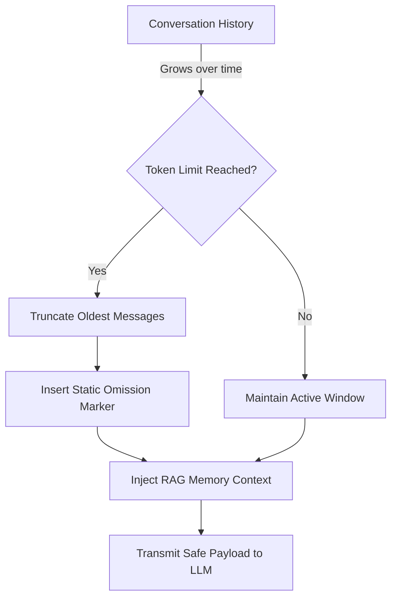

## Agents

In Tandem, an **Agent** is a specialized persona with specific instructions, permissions, and tools.

An agent is not a process by itself. It is the instruction and policy profile the engine uses when building a run. The actual execution still happens through the session/run/runtime loop.

For policy-gated multi-agent spawning and lineage tracking, see [Agent Teams](https://docs.tandem.ac/agent-teams/).

### Built-in Agents

Tandem comes with several built-in agents:

- **`build` (Default)**: Focused on implementation. Inspects the codebase before answering.
- **`plan`**: Focused on high-level planning and scoping.
- **`explore`**: A sub-agent for gathering context and mapping the codebase.
- **`general`**: A general-purpose helper.

### Custom Agents

You can define custom agents by creating markdown files in `.tandem/agent/`.
Example: `.tandem/agent/reviewer.md`

```markdown
---
name: reviewer
mode: primary
tools: ["read", "scan"]
---

You are a code review agent. Focus on finding bugs and security issues.
```

### Agent Modes

- **Primary**: Can be selected as the main agent for a session.
- **Subagent**: Designed to be called by other agents (or used for specific sub-tasks), usually hidden from the main selection menu.

## Sessions

A **Session** is a conversation thread with an agent.

For the full runtime walkthrough, see [How Tandem Works Under the Hood](https://docs.tandem.ac/how-tandem-works/).

- Sessions are persisted in `storage/session/`.
- Each session maintains its own message history and context.
- You can switch agents mid-session, though it is usually better to start a new session for a different mode of work.

## Sessions, Runs, and Context

These terms are easy to blur, but agents should keep them separate:

| Term             | Meaning                                                                                      |
| ---------------- | -------------------------------------------------------------------------------------------- |
| Session          | Durable conversation record and metadata                                                     |
| Run              | One active execution of a session                                                            |
| Provider payload | The bounded set of messages, memory, and runtime instructions sent to the model for this run |
| Event stream     | The live SSE stream of run progress                                                          |
| Memory           | Reusable retrieval store separate from the transcript                                        |

The session is the source of truth for the conversation. A run is a temporary execution attached to that session. The provider payload is derived from session history, context policy, memory, and tools; it is not a raw dump of the entire session.

For a compact agent-facing map of these boundaries, see [Agent Runtime Contracts](./agent-runtime-contracts/).

### Infinite Context Protection

Tandem sessions are designed to run indefinitely without suffering from "context snowballing"—a common issue where agent rules and tool metadata accumulate until the LLM's token limit is completely exhausted.



As your conversation grows, Tandem employs a strict sliding window: it gracefully truncates older turns, replacing them with a static placeholder marking the omission. Instead of forcing the LLM to re-read everything repetitively, the engine keeps the active payload bounded and relies on retrieval memory for reusable facts. This keeps the context boundary stable without turning memory into a garbage dump.

## The Loop

When you send a message, the **Engine Loop**:

1. Appends your message to the history.
2. Selects the active agent's system prompt.
3. Builds a bounded provider payload from history, memory, runtime context, model settings, and tool policy.
4. Sends the payload to the LLM provider.
5. **Tool Use**: If the LLM requests a tool, the engine checks policy, executes the tool, and feeds the result back as a message part.
6. Streams run events back to the client.
7. Repeats until the model produces a final response or the run ends with an error/cancellation state.
