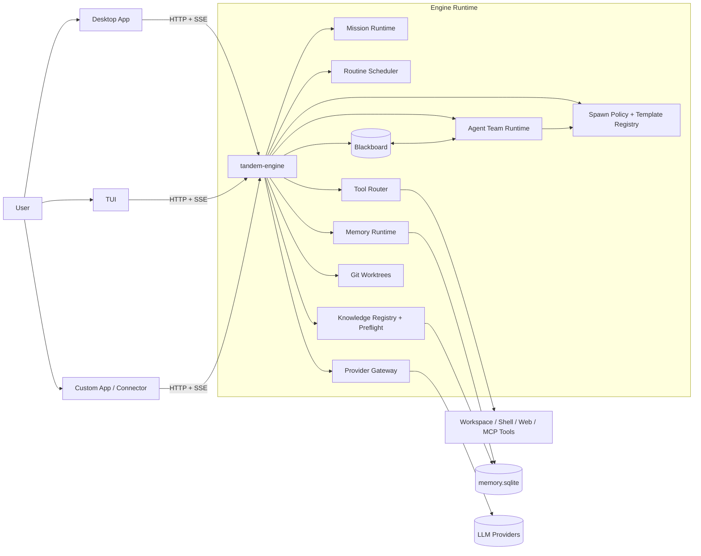
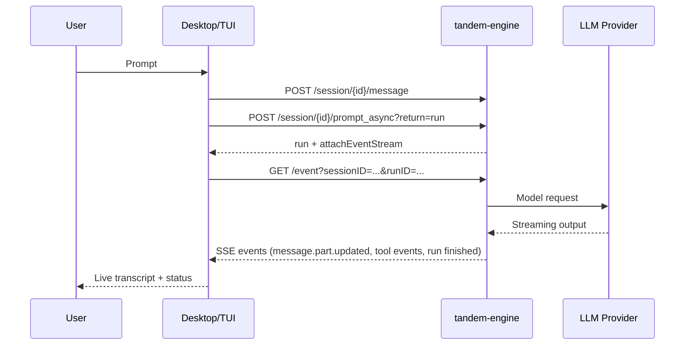
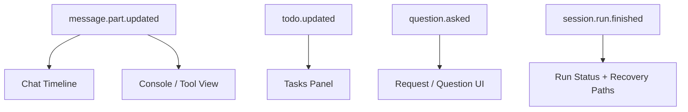

This page gives a practical mental model of how Tandem components fit together.

For the more complete runtime walkthrough, see [How Tandem Works Under the Hood](https://docs.tandem.ac/how-tandem-works/).

## System Overview

Tandem keeps **run-scoped working state** in the blackboard and run artifacts, then promotes validated outcomes into **project-scoped reusable knowledge**. The knowledge registry and preflight layer decide when prior work should be reused, when it should be refreshed, and when raw intermediate output should stay local instead of becoming shared truth.

## Runtime Boundaries

Agents should treat Tandem as a set of cooperating runtime boundaries:

| Boundary             | Owned by                              | Durable?                        | Notes for agents                                                    |
| -------------------- | ------------------------------------- | ------------------------------- | ------------------------------------------------------------------- |
| Session history      | Session storage                       | Yes                             | Source of truth for conversation messages                           |
| Active run           | Engine run registry + events          | During execution                | One execution attached to a session                                 |
| Provider payload     | Engine loop                           | No                              | Derived, bounded prompt sent to the model                           |
| Tool execution       | Tool router + policy                  | Results persist as parts/events | Tool visibility is not the same as permission to execute everywhere |
| Memory               | `memory.sqlite`                       | Yes                             | Retrieval store, separate from raw transcript                       |
| Knowledge            | Knowledge registry                    | Yes                             | Promoted reusable facts with scope/trust/freshness                  |
| Blackboard/artifacts | Context run storage + workspace files | Yes                             | Inspectable execution products and handoffs                         |
| MCP catalog          | Engine MCP runtime                    | Derived/configured              | Cataloged does not mean connected or enabled                        |

When answering architecture questions, name the boundary explicitly. For example, "the run streamed an event" is different from "the session persisted a message," and "memory retrieved a fact" is different from "the workflow reused promoted knowledge."

## Request Lifecycle

## Event Model

Events are the live reporting surface. They should be used for progress, diagnostics, and UI updates, but agents should not treat an event alone as the durable source of truth. If the question is historical, inspect the persisted session, run state, artifact, memory, or knowledge record that the event describes.

## Agent-Facing Navigation

If another agent is reading these docs through MCP, these are the best starting points:

- [Agent Runtime Contracts](./agent-runtime-contracts/) for terminology and boundaries.
- [How Tandem Works Under the Hood](./how-tandem-works/) for session/run/event/memory flow.
- [Memory Internals](./memory-internals/) for memory storage and retrieval details.
- [Creating And Running Workflows And Missions](./creating-and-running-workflows-and-missions/) for choosing workflow abstractions.
- [MCP Capability Discovery And Request Flow](./mcp-capability-discovery-and-request-flow/) for connector/tool availability reasoning.
