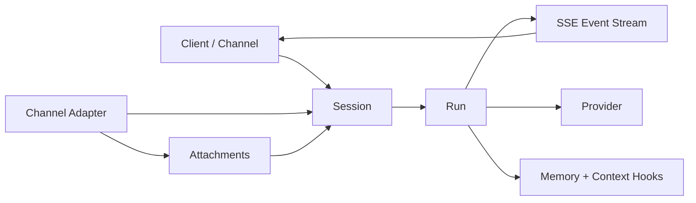

Tandem is a session-oriented engine. A **session** is the durable conversation record, a **run** is one execution of that session, and a **message** is made of ordered **parts**. The engine streams state changes as events instead of treating the transcript as one opaque blob.

If you only need setup or user-facing workflows, use the guide pages. If you need to answer "how does Tandem actually work?" or debug a hallucination, start here.

## The Mental Model



The important distinction is:

- the **session** persists between turns
- the **run** is the active execution attached to one session
- the **event stream** is how the engine reports progress
- the **memory store** is separate from the raw transcript

## Runtime Primitives

The core wire/runtime objects are:

- **Session**: persisted under `sessions.json`, with metadata such as title, directory, workspace root, project ID, provider/model, and the message history.
- **Message**: a user or assistant turn stored inside the session history.
- **Part**: the ordered pieces of a message. Tandem uses text parts, reasoning parts, and tool invocation/result parts.
- **Run**: a single execution of a session, identified by `runID`.
- **Event**: streamed runtime output such as `message.part.updated`, `session.run.started`, `session.run.finished`, `todo.updated`, `question.asked`, and `agent_team.*`.
- **Memory record**: a chunk in `memory.sqlite` with a tier, source, and metadata.

`session_meta.json` stores snapshot history and session flags such as archived/shared state, parent lineage, revert state, and TODOs.

## Run Lifecycle

The main chat path is `POST /session/{id}/prompt_async`.

1. The client creates or appends the user message.
2. The engine acquires the session run lock.
3. If another run is already active, Tandem returns `409 Conflict` with the active run details and an `attachEventStream` path.
4. If the request is accepted, the engine emits `session.run.started`.
5. The run is streamed over SSE from `/event?sessionID=<id>&runID=<runID>`.
6. The engine publishes `message.part.updated` events as text and tool parts evolve.
7. The run ends with `session.run.finished`.

When the caller requests `?return=run`, Tandem returns the `runID` and the SSE attach path immediately, which is how thin clients and channel adapters bind to the same execution.

The synchronous path uses the same engine logic, but blocks until the run is complete.

### What gets streamed

- text deltas from the model
- tool invocation and tool result updates
- permission and question events
- terminal status and error events

If a run fails or times out, Tandem persists an error message into the session history and finishes the run with an error status instead of silently dropping the failure.

## Context and Memory

Tandem keeps **raw transcript history** separate from **retrieval memory**.

- The session history is the source of truth for what happened in that session.
- The engine builds a bounded provider payload and trims older turns instead of growing one infinite prompt forever.
- Memory lives in `memory.sqlite` and is tiered:
  - `session` for ephemeral session-scoped chunks
  - `project` for reusable project facts
  - `global` for cross-project user patterns and preferences

When memory is injected for prompting, it is formatted as a structured block like:

```text
<memory_context>
  <current_session>...</current_session>
  <relevant_history>...</relevant_history>
  <project_facts>...</project_facts>
</memory_context>
```

That means Tandem can reuse context without replaying the full transcript every time.

### Channel archival memory

Channel sessions add a second retrieval layer for long-lived chat integrations:

- raw channel transcripts still live in normal Tandem session storage
- after a successful channel reply, Tandem archives the latest completed user + assistant exchange into global memory
- the archived record is deduped by source hash and stores provenance such as session ID, project ID, workspace root, and message IDs

This is the key reason the docs need a canonical under-the-hood page: if someone asks about "Discord session context" or "Telegram channel memory", the correct answer is not "the whole channel transcript is loaded every time". The correct answer is that Tandem keeps the transcript and retrieval memory separate, then archives selected completed exchanges for reuse.

For a deeper storage-level breakdown of the memory layers, see [Memory Internals](./memory-internals/).

## Channel Flow

Discord, Telegram, and Slack all ride the same engine session contract, but each adapter normalizes inbound messages differently before calling `prompt_async`.

- **Discord** connects through the Gateway WebSocket, maintains a heartbeat, normalizes bot mentions, and chunks outbound replies to Discord's 2000-character limit.
- **Telegram** uses long polling, renders outbound MarkdownV2 safely, and chunks replies to Telegram's 4096-character limit.
- **Slack** polls `conversations.history`, filters self-messages, and replies through `chat.postMessage`.

Common adapter behavior:

1. Normalize inbound text and detect whether the bot was explicitly mentioned.
2. Attach file/media payloads when the adapter supports media ingestion.
3. Store uploads under `channel_uploads/<channel>/<chat_or_user>/...`.
4. Forward `text` and `file` prompt parts to `/session/{id}/prompt_async`.
5. Stream the run result back over SSE and post the final reply into the channel.

Channel adapters map channel/user identity to the Tandem session they own, so a channel conversation behaves like a stable engine session rather than a fire-and-forget webhook.

## Agent Teams And Missions

Agent teams sit on top of the same engine runtime, but they add policy-gated spawning and mission lineage.

- `SpawnPolicy` controls whether spawning is enabled, whether justification is required, role-to-role edges, skill requirements, and budget limits.
- spawn requests can come from the UI, from a tool call, or from the orchestrator runtime
- approvals can be required before a spawn is executed
- mission events stream alongside normal session events

Useful lifecycle events include:

- `agent_team.spawn.requested`
- `agent_team.spawn.approved`
- `agent_team.spawn.denied`
- `agent_team.instance.started`
- `agent_team.instance.completed`
- `agent_team.instance.failed`
- `agent_team.instance.cancelled`
- `agent_team.budget.exhausted`
- `agent_team.mission.budget.exhausted`

The practical mental model is that a mission can fan out into multiple spawned sessions, but each spawned worker still uses the same underlying session/run/event machinery.

## Storage And Wire Contracts

These are the most important persisted/runtime surfaces:

- `sessions.json` - canonical session storage
- `session_meta.json` - snapshots, revert state, archive/shared flags, and TODOs
- `questions.json` - pending structured question requests
- `memory.sqlite` - memory chunks, retrieval state, and knowledge records
- `channel_uploads/` - inbound media and file attachments from channel adapters

The public wire types mirror the runtime model:

- `WireSession`
- `WireSessionMessage`
- `WireMessagePart`

The wire format uses stable identifiers like `sessionID` and `runID`, and tool parts are exposed as `type: "tool"` with `state` transitions such as `running`, `completed`, `failed`, or `denied`.

## What Tandem Does Not Do

- It does not treat a Discord or Telegram thread as one giant prompt forever.
- It does not automatically share context across unrelated channel sessions.
- It does not replay the entire transcript into every run.
- It does not use memory as a raw chat-log dump.
- It does not make agent-team spawning automatic without policy and budget checks.

## See Also

- [Architecture](./architecture/)
- [Agents & Sessions](./agents-and-sessions/)
- [Memory Internals](./memory-internals/)
- [Channel Integrations](./channel-integrations/)
- [Protocol Matrix](./protocol-matrix/)
- [Engine Commands](./reference/engine-commands/)
