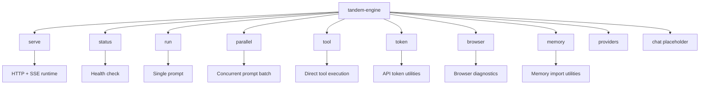

The `tandem-engine` binary supports several subcommands for running the server and executing tasks.

## Command Map



## `serve`

Starts the Tandem Engine server. This is the default mode for handling client connections.

```bash
tandem-engine serve [OPTIONS]
```

**Options:**

- `--hostname <HOSTNAME>` / `--host <HOSTNAME>`: The interface to bind to (default: `127.0.0.1`, env: `TANDEM_ENGINE_HOST`).
- `--port <PORT>`: The port to listen on (default: `39731`, env: `TANDEM_ENGINE_PORT`).
- `--state-dir <DIR>`: Custom directory for storing engine state (config, logs, storage).
- `--in-process`: Run in in-process mode (for development/debugging).
- `--provider <ID>`: Provider ID for this process (`openai`, `openrouter`, `anthropic`, `ollama`, `groq`, `mistral`, `together`, `azure`, `bedrock`, `vertex`, `copilot`, `cohere`).
- `--model <ID>`: Provider model override for this process.
- `--api-key <KEY>`: API key override for the selected provider for this process.
- `--config <PATH>`: Override config file path.
- `--api-token <TOKEN>`: Set an explicit token for HTTP endpoints (Authorization Bearer, canonical `X-Agent-Token`, or compatibility `X-Tandem-Token`; env: `TANDEM_API_TOKEN`). If omitted, `serve` loads or creates a shared token by default.
- `--unsafe-no-api-token`: Advanced local-only opt-out that disables HTTP API token auth (env: `TANDEM_UNSAFE_NO_API_TOKEN=1`).
- `--web-ui`: Enable embedded web admin UI (env: `TANDEM_WEB_UI`).
- `--web-ui-prefix <PATH>`: Path prefix for embedded web admin UI (default: `/admin`, env: `TANDEM_WEB_UI_PREFIX`).

## `status`

Checks engine health by calling `GET /global/health` on a target host/port.

```bash
tandem-engine status [OPTIONS]
```

**Options:**

- `--hostname <HOSTNAME>` / `--host <HOSTNAME>`: Hostname or IP to check (default: `127.0.0.1`, env: `TANDEM_ENGINE_HOST`).
- `--port <PORT>`: Port to check (default: `39731`, env: `TANDEM_ENGINE_PORT`).

## `browser`

Browser readiness and diagnostics. This is the operator-facing entrypoint for headless browser setup on desktops and VPS hosts.

```bash
tandem-engine browser <status|doctor|install> [OPTIONS]
```

### `browser status`

Check browser readiness through a running engine (`GET /browser/status`).

```bash
tandem-engine browser status [OPTIONS]
```

- `--hostname <HOSTNAME>` / `--host <HOSTNAME>`: Hostname or IP to check (default: `127.0.0.1`, env: `TANDEM_ENGINE_HOST`).
- `--port <PORT>`: Port to check (default: `39731`, env: `TANDEM_ENGINE_PORT`).

### `browser doctor`

Run local browser readiness diagnostics using the same effective engine config the server would use.

```bash
tandem-engine browser doctor [OPTIONS]
```

- `--state-dir <DIR>`: Engine state directory used to resolve the config file.
- `--config <PATH>`: Override config file path.
- `--json`: Print the full readiness payload as JSON.

### `browser install`

Install the matching `tandem-browser` sidecar onto the engine host from GitHub Releases.

```bash
tandem-engine browser install [OPTIONS]
```

- `--state-dir <DIR>`: Engine state directory used to resolve the config file.
- `--config <PATH>`: Override config file path.
- `--json`: Print the install result as JSON.

### Browser HTTP Endpoints

The browser command group pairs with runtime HTTP endpoints:

- `GET /browser/status`
- `POST /browser/install`
- `POST /browser/smoke-test`

These endpoints are for browser readiness and install flows. Actual browser automation is exposed through engine tools such as `browser_open`, `browser_click`, `browser_type`, `browser_extract`, and `browser_screenshot`.

Use one of these paths for browser automation:

- `tandem-engine tool --json ...`
- `POST /tool/execute`
- session-based agent runs with the browser tools included in the run allowlist

For `browser_wait`, the canonical tool args use `condition: { kind, value }`, but the engine also accepts `wait_for` / `waitFor`, camelCase fields like `sessionId`, and short forms like top-level `selector`, `text`, or `url`.

### Headless Hosts

Browser automation does not require a visible desktop session. On Linux VPS hosts the engine only needs:

- `tandem-browser` installed on the same host as `tandem-engine`
- a Chromium-based browser executable such as Chrome, Chromium, or Edge
- the required Linux shared libraries for Chromium

If the browser executable is not on `PATH`, set `TANDEM_BROWSER_EXECUTABLE` or `browser.executable_path`.

For a full setup and test flow, see [Browser Setup and Testing](../browser-setup-and-testing/).

## `memory`

Memory import utilities for seeding Tandem memory from existing files or an OpenClaw export.

```bash
tandem-engine memory import [OPTIONS]
```

The same importer is also exposed at runtime through `POST /memory/import` and the SDK memory import helpers. Use the HTTP or SDK API when an application, automation, or control panel flow should import knowledge without shelling out to the CLI.

### `memory import`

Import OpenClaw memory files or a markdown/text directory into Tandem memory.

```bash
tandem-engine memory import --path ./docs --tier global
```

- `--path <PATH>`: Path to an OpenClaw root or a directory of markdown/text files to import.
- `--format <FORMAT>`: Import format, either `directory` or `openclaw` (default: `directory`).
- `--tier <TIER>`: Target memory tier, one of `global`, `project`, or `session` (default: `global`).
- `--project-id <PROJECT_ID>`: Required when `--tier project`.
- `--session-id <SESSION_ID>`: Required when `--tier session`.
- `--sync-deletes`: Remove previously imported records whose source files no longer exist under the import root.
- `--state-dir <DIR>`: Engine state directory used to resolve `memory.sqlite` and config.

**Examples:**

```bash
tandem-engine memory import --path ~/.openclaw --format openclaw
tandem-engine memory import --path ./notes --tier global
tandem-engine memory import --path ./docs --tier project --project-id repo-123 --sync-deletes
```

Equivalent HTTP request:

```json
{
  "source": {
    "kind": "path",
    "path": "./docs"
  },
  "format": "directory",
  "tier": "project",
  "project_id": "repo-123",
  "session_id": null,
  "sync_deletes": true
}
```

The API returns import stats for discovered files, indexed files, skipped files, deleted files, created chunks, and errors.

## `run`

Execute a single prompt and exit. Useful for quick CLI queries or scripting.

```bash
tandem-engine run "<PROMPT>"
```

**Options:**

- `--provider <ID>`: Provider for this run. Unknown IDs fail fast.
- `--model <ID>`: Provider model override for this run.
- `--api-key <KEY>`: API key override for this run's provider.
- `--config <PATH>`: Override config file path.

**Example:**

```bash
tandem-engine run "What is the capital of France?"
```

**Provider precedence:**

- `run --provider` uses that provider explicitly.
- If no explicit provider is passed, `default_provider` from config is used.
- If `default_provider` is missing or unavailable, Tandem falls back to the first configured provider.

**API key behavior:**

- `--api-key` applies only to the selected provider for that command invocation.
- Without `--api-key`, Tandem uses provider-specific config/env vars (for example `OPENROUTER_API_KEY`, `OPENAI_API_KEY`, `ANTHROPIC_API_KEY`).

## `tool`

Execute a specific tool directly by passing a JSON payload.

```bash
tandem-engine tool --json '<JSON_PAYLOAD>'
```

**Options:**

- `--json <JSON>`: The JSON payload defining the tool and arguments. Can be a raw string, a file path (`@path/to/file.json`), or `-` for stdin.
- `--state-dir <DIR>`: Custom state directory.

**Example Payload:**

```json
{
  "tool": "read",
  "args": {
    "path": "README.md"
  }
}
```

Browser automation uses this same tool execution surface. Example:

```json
{
  "tool": "browser_open",
  "args": {
    "url": "https://example.com"
  }
}
```

### MCP auth-required and retry behavior

For MCP-backed tools, Tandem can emit an explicit authorization event when upstream requires OAuth/account consent:

- Event: `mcp.auth.required`
- Event: `mcp.auth.pending` (challenge still pending, call short-circuited)
- MCP runtime state fields:
  - `last_auth_challenge`
  - `mcp_session_id`

If auth is required, complete authorization and retry the tool call. Tandem applies an engine-level re-probe cooldown (~15s) per challenged tool to prevent auth loops. A full engine restart is not required.

### MCP argument normalization (engine-wide)

Before forwarding MCP `tools/call`, Tandem normalizes common argument-key drift against tool schema.

Examples:

- `taskTitle` -> `task_title`
- `listId` -> `list_id`
- common alias recovery such as `name` -> `task_title` when required by schema

This behavior runs in engine runtime and applies to web, TUI, channels, and direct CLI usage.

## `chat`

Planned interactive REPL mode. This command is currently a placeholder.

## `parallel`

Run multiple prompts concurrently and return a JSON summary.

```bash
tandem-engine parallel --json '<JSON_PAYLOAD>' --concurrency 4
```

**Options:**

- `--json <JSON>`: Array of prompts, array of objects, or `{ "tasks": [...] }` wrapper. Accepts raw JSON, `@file`, or `-` for stdin.
- `--concurrency <N>`: Max concurrent tasks (default: `4`).
- `--provider <ID>`: Default provider for tasks without explicit provider.
- `--model <ID>`: Default model override for the provider.
- `--api-key <KEY>`: API key override for this batch.
- `--config <PATH>`: Override config file path.

## `providers`

List supported provider IDs for `--provider`.

```bash
tandem-engine providers
```

## `token`

API token utilities (used with `--api-token`).

```bash
tandem-engine token generate
```

## Agent Team HTTP Examples

These are HTTP endpoints exposed by the running engine (not CLI subcommands).

```bash
curl -s http://127.0.0.1:39731/agent-team/templates | jq .
curl -s http://127.0.0.1:39731/agent-team/instances | jq .
curl -s -X POST http://127.0.0.1:39731/agent-team/spawn \
  -H "content-type: application/json" \
  -d '{"missionID":"m1","role":"worker","templateID":"worker-default","source":"ui_action","justification":"parallelize implementation"}' | jq .
```

## Practical Examples

### Run Engine with API Token

```bash
TANDEM_API_TOKEN="tk_your_token_here" tandem-engine serve --hostname 127.0.0.1 --port 39731
```

### Run One Prompt with Explicit Provider and Model

```bash
tandem-engine run "Write a concise release summary." --provider openrouter --model openai/gpt-4o-mini
```

### Run a Concurrent Batch

```bash
cat > tasks.json << 'JSON'
{
  "tasks": [
    { "id": "plan", "prompt": "Create a 3-step rollout plan." },
    { "id": "risks", "prompt": "List top 5 rollout risks." },
    { "id": "comms", "prompt": "Draft a short launch update." }
  ]
}
JSON

tandem-engine parallel --json @tasks.json --concurrency 3
```

### Execute Tools Directly

```bash
tandem-engine tool --json '{"tool":"workspace_list_files","args":{"path":"."}}'
tandem-engine tool --json '{"tool":"websearch","args":{"query":"tandem engine protocol matrix","limit":5}}'
tandem-engine tool --json '{"tool":"memory_search","args":{"query":"mission runtime","user_id":"user-123","limit":5}}'
```

`spawn_agent` is runtime-gated and should be called from a session prompt (not `tandem-engine tool` direct mode):

```bash
curl -s -X POST http://127.0.0.1:39731/session/<session_id>/prompt_async \
  -H "content-type: application/json" \
  -d '{"parts":[{"type":"text","text":"/tool spawn_agent {\"missionID\":\"m1\",\"role\":\"worker\",\"templateID\":\"worker-default\",\"source\":\"tool_call\",\"justification\":\"parallelize implementation\"}"}]}'
```

### Start `prompt_async` with file attachments

Send rich prompt parts (text + files) in one call:

```bash
curl -s -X POST "http://127.0.0.1:39731/session/<session_id>/prompt_async?return=run" \
  -H "content-type: application/json" \
  -H "X-Agent-Token: tk_your_token" \
  -d '{
    "parts": [
      { "type": "file", "mime": "image/jpeg", "filename": "photo.jpg", "url": "/srv/tandem/channel_uploads/telegram/123/photo.jpg" },
      { "type": "text", "text": "Describe this image and summarize key details." }
    ]
  }'
```

Notes:

- `url` may be an HTTP URL, a local path, or `file://...` path.
- `mime` should match the file type (`image/jpeg`, `text/markdown`, `application/pdf`, etc).
- Stream completion can surface as `run.complete`, `run.completed`, or `session.run.finished` depending on client/version.

### Browser Playground (Interactive)

Use the included browser playground in `docs/example.html` to test:

- session creation
- async runs + SSE streaming
- token-auth requests
- mission/routine API interactions

```bash
python -m http.server 8080 --directory docs
```

Then open `http://127.0.0.1:8080/example.html`.
